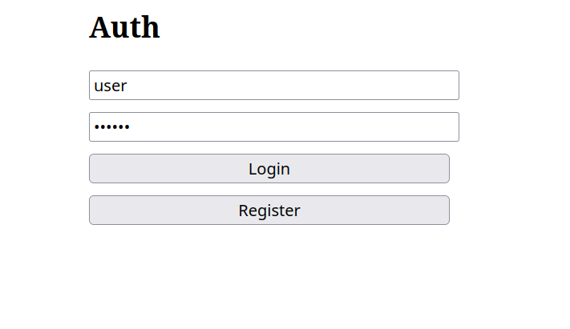
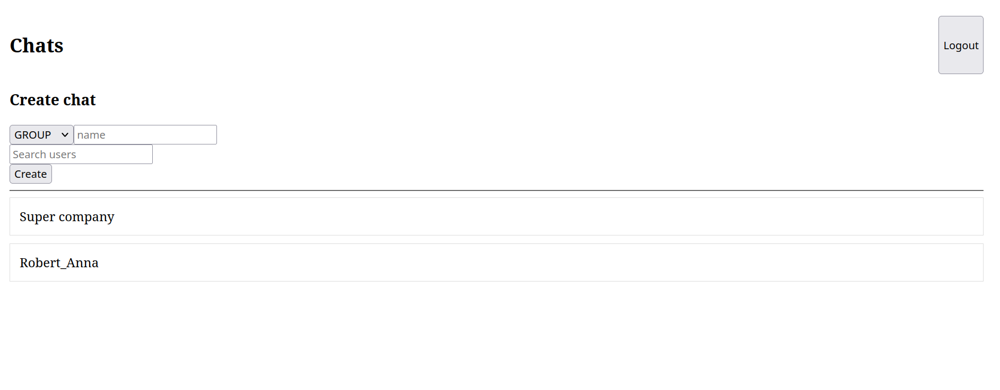
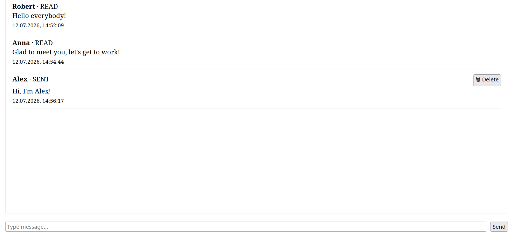

# Messenger

⚠️ Проект находится в активной стадии разработки.
Функциональность регулярно расширяется и может изменяться. Некоторые возможности находятся в процессе реализации, архитектура и API продолжают совершенствоваться.

Учебный проект - мессенджер, построенный как модульный монолит с использованием **Spring Boot**, **React**, **Apache Kafka** и **WebSocket**.
Kafka применяется для асинхронной обработки событий и обмена сообщениями между компонентами приложения.

Проект демонстрирует разработку полнофункционального приложения для обмена сообщениями в реальном времени с использованием современных технологий backend и frontend.

---

## Возможности

* Регистрация и аутентификация пользователей (JWT)
* Создание личных и групповых чатов
* Отправка сообщений в режиме реального времени
* WebSocket (STOMP) для мгновенной доставки сообщений
* Kafka для обмена событиями между компонентами
* История сообщений
* Управление участниками групп
* Защищенные REST API
* Docker Compose для локального запуска

---

## Используемые технологии

### Backend

* Java 21
* Spring Boot
* Spring Security
* Spring Data JPA
* Hibernate
* PostgreSQL
* Apache Kafka
* WebSocket (STOMP)
* JWT Authentication
* Maven

### Frontend

* React
* TypeScript
* Vite
* Axios
* React Router

### Infrastructure

* Docker
* Docker Compose

---

## Архитектура

```
                +----------------------+
                |      React App       |
                +----------+-----------+
                           |
                    REST / WebSocket
                           |
                +----------v-----------+
                |    Spring Boot API   |
                +----------+-----------+
                           |
          +----------------+----------------+
          |                                 |
     PostgreSQL                        Apache Kafka
          |                                 |
   Хранение данных            Обработка событий
```

---

## Использование Kafka

Kafka используется для асинхронной обработки событий внутри приложения.

Примеры событий:

* отправка сообщения;
* создание чата;
* удаление чата;
* уведомления об изменениях;
* доставка сообщений через WebSocket.

Это позволяет разделить бизнес-логику и обмен сообщениями, а также сделать приложение более масштабируемым.

---

## Использование WebSocket

WebSocket обеспечивает мгновенную доставку сообщений пользователям без постоянного опроса сервера.

Используется протокол **STOMP** поверх WebSocket.

---

## Запуск проекта

### Клонирование

```bash
git clone https://github.com/IAmAnAlligator/messenger.git
cd messenger
```

### Перед запуском

Перед запуском проекта необходимо заполнить конфигурационные файлы с переменными окружения.

### Backend

Создайте или отредактируйте файл:

```text
backend/src/main/resources/application-secrets.yml
```

Укажите необходимые параметры подключения к базе данных, JWT и другие секреты проекта.

### Docker

Заполните файл:

```text
backend/docker/.env
```

В нем должны быть указаны переменные окружения, используемые `docker-compose`, например:

* параметры PostgreSQL;
* настройки Kafka;
* другие переменные, необходимые для запуска контейнеров.

> **Важно:** файлы с секретами и переменными окружения не содержатся в репозитории и должны быть настроены перед первым запуском проекта.


### Запуск контейнеров Docker

```bash
cd backend/docker

docker compose up --build
```

### Backend

```bash
cd backend

./mvnw spring-boot:run
```

### Frontend

```bash
cd frontend

npm install
npm run dev
```

После запуска будут доступны:

| Сервис   | Адрес                 |
| -------- | --------------------- |
| Frontend | http://localhost:5173 |
| Backend  | http://localhost:8080 |

---

## Что было реализовано

* JWT-аутентификация
* REST API
* WebSocket-соединения
* Kafka Producer/Consumer
* Групповые и личные чаты
* CRUD для чатов
* История сообщений
* Защита API через Spring Security
* Docker-конфигурация
* React-интерфейс

---

## Цель проекта

Проект разработан в учебных целях для изучения современных подходов к построению распределённых веб-приложений с использованием:

* Spring Boot;
* React;
* Apache Kafka;
* PostgreSQL;
* WebSocket;
* Docker.

Основное внимание уделялось построению масштабируемой архитектуры, обмену сообщениями в реальном времени и взаимодействию frontend и backend.

## Скриншоты

<p align="center">
  
</p>

<p align="center">
  
</p>

<p align="center">
  
</p>